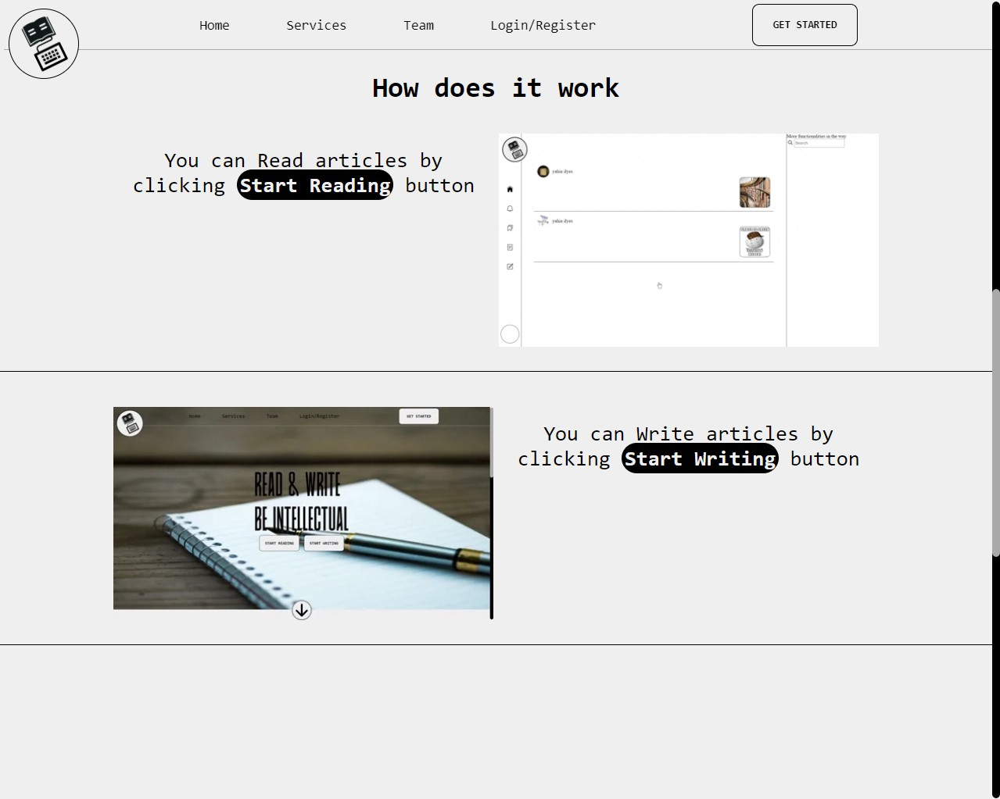
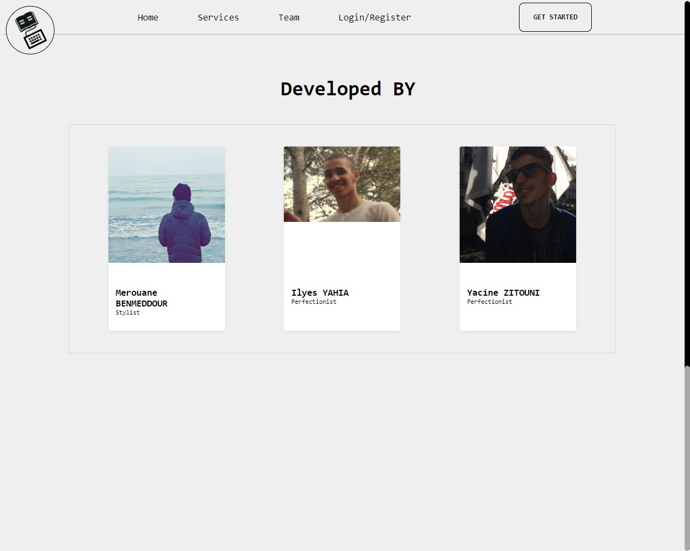
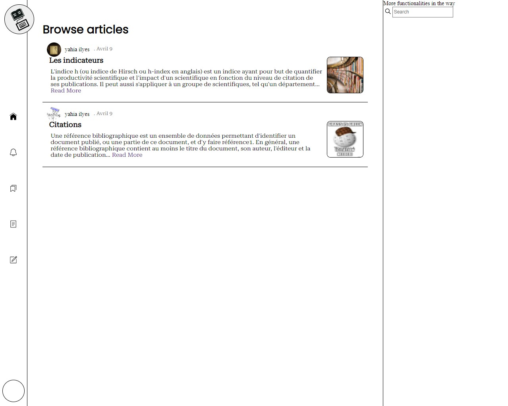

|  #  | TABLE OF CONTENT                          |
| :-: | ----------------------------------------- |
|  1  | [What it's all about](#what-is-all-about) |
|  2  | [PAGES](#pages)                           |
|  3  | [Dev Team](#developersّّ)                 |
|  4  | [To Do list](#to-do-list)                 |

# What it's all about!

- _Short DEF:_
  > a frontend design for an article website,
- _Long DEF:_
  > University project we worked for, to learn some frontend dev with HTML and CSS

# PAGES

| <h1 style="text-align: center;">Landing page design </h1> |
| --------------------------------------------------------- |
|                         |

| <h1 style="text-align: center;">Site Definition page </h1> |
| ---------------------------------------------------------- |
|                              |

| <h1 style="text-align: center;">Developers Team page </h1> |
| ---------------------------------------------------------- |
|                   |

| <h1 style="text-align: center;">Article index page </h1> |
| -------------------------------------------------------- |
|                       |

| <h1 style="text-align: center;">Article content page </h1> |
| ---------------------------------------------------------- |
|                       |

# Developersّّ

|                                             |
| ------------------------------------------- |
| [Ilyes](https://github.com/ilyes-d)         |
| [merouane](https://github.com/merouanebj)   |
| [Yacine](https://github.com/yacine-zitouni) |

# To DO list

- [x] Landing page
- [x] article-index page
- [x] article-content page
  - [ ] publisher design
- [ ] aside design
